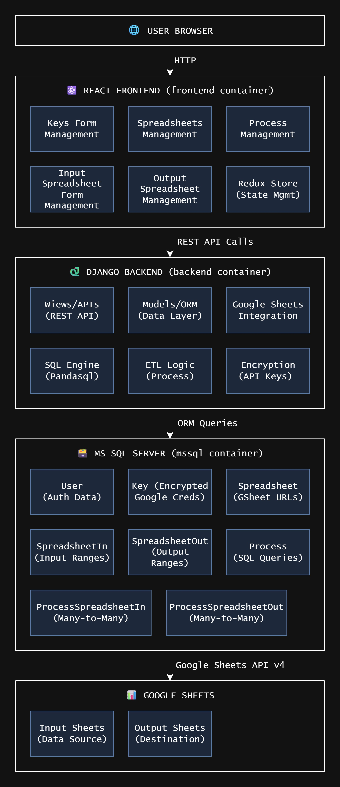
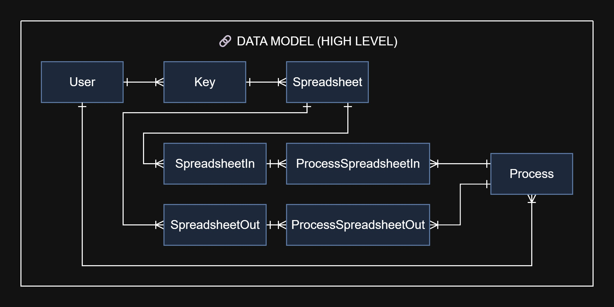
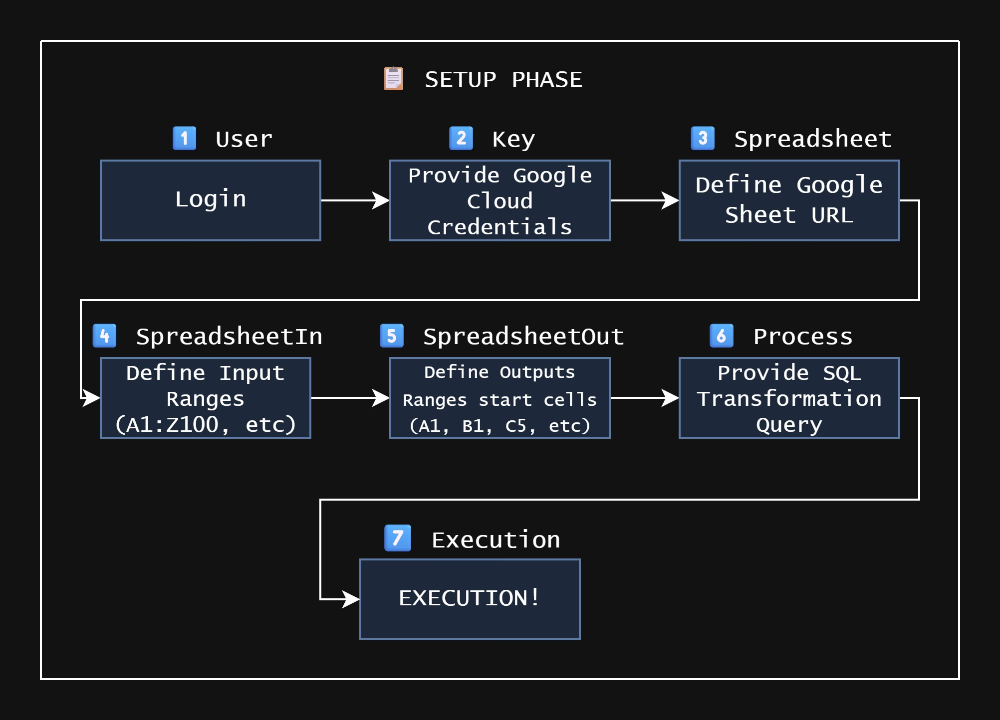
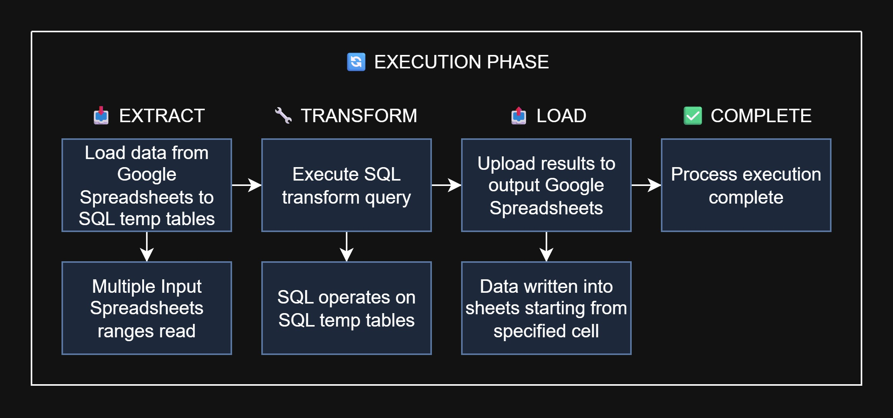

# Grid Scope

## 🚀 Summary
Grid Scope is a web application that allow user load data from any number of google spreadsheets, transform them using SQL scripts and then upload them into another google spreadsheet. Everything is simple and straightforward. Try it yourself!

## 📊 Project Stats

issues | pull requests | activity | contributors | stars | forks | licence
-------|---------------|----------|--------------|-------|-------|--------
[](https://github.com/WojciechWlo/grid_scope/issues) | [](https://github.com/WojciechWlo/grid_scope/pulls) | [](https://github.com/WojciechWlo/grid_scope/commits/main) | [](https://github.com/WojciechWlo/grid_scope/graphs/contributors) |[](https://github.com/WojciechWlo/grid_scope/stargazers) | [](https://github.com/WojciechWlo/grid_scope/forks) |  [](https://creativecommons.org/licenses/by-nc-sa/4.0/)

## 🌐 Tested Browsers


## 📑 Table of Contents
- [🚀 About](#-about)
- [🏛️ Architecture](#%EF%B8%8F-architecture)
  - [🏛️ High Level Design](#%EF%B8%8F-high-level-design)
  - [🔗 Data Model](#-data-model)
  - [📋 Setup Phase](#-setup-phase)
  - [🔄 Execution Phase](#-execution-phase)
- [🧰 Techstack](#-techstack)
  - [🔧 Backend](#-backend)
  - [🖼️ Frontend](#-frontend)
- [📝 Prerequisites](#-prerequisites)
- [⚙️ Setup](#%EF%B8%8F-setup)
- [⚡ Getting Started](#-getting-started)
- [🗒️ Note](#%EF%B8%8F-note)
- [⏳ Future Work](#-future-work)
- [🤝 Feedback and Contributions](#-feedback-and-contributions)
- [📄 License](#-license)
- [🗨️ Contact](#%EF%B8%8F-contact)


## 🚀 About
Grid Scope is a web application that allow user load data from any number of google spreadsheets, transform them using SQL scripts and then upload them into another google spreadsheet. Such ETL process is really simple. User just need to:
1. recover its Google Cloud Console key (which is considered the most difficult in entire process :) )
1. provide it in the **Keys form**
1. provide spreadsheet data in the **Spreadsheets form**
1. provide input ranges in the spreadsheets (specified in the previous step) in the **Inputs form**
1. provide output cell in the spreadsheets (specified in the previous step) in the **Outputs form**
1. define process by providing list of input ranges, providing SQL query transforming them and then choosing the output spreadsheets in the **Processes form**

All data (specifically the processes) are preserved and may be quickly executed just by clicking the button!


## 🏛️ Architecture
Here is architecture of Grid Scope

### 🏛️ High Level Design


### 🔗 Data Model


### 📋 Setup Phase


### 🔄 Execution Phase



## 🧰 Techstack


### 🔧 Backend
- **[Python](https://www.python.org/)** - The core programming language for backend development.
- **[Django](https://www.djangoproject.com/)** - A high-level Python web framework used to build RESTful APIs and handle server-side logic.
- **[MsSQL Server](https://www.microsoft.com/en-us/sql-server/)** - Relational database management system used to store and manage application data.

### 🖼️ Frontend
- **[React](https://reactjs.org/)** - A JavaScript library for building interactive and responsive user interfaces.
- **[Redux](https://redux.js.org/)** - A predictable state management library for managing application state across React components.


## 📝 Prerequisites
For Windows
- **[Docker Desktop](https://docs.docker.com/desktop/)** (tested with v4.25.2)

For Linux
- **[Docker](https://www.docker.com/)**

## ⚙️ Setup
Environment variable | Description | Example value
---------------------|-------------|--------------
MODE | Parameter to set if project is in development or production mode | development
PYTHONUNBUFFERED | If set then Python logs are printed in realtime in docker logs | 1
CHOKIDAR_USEPOLLING | | true
WATCHPACK_POLLING | | true
ACCEPT_EULA | Flag used for accepting (or refusing) EULA of mssql server | Y
MSSQL_PID | Tells SQL Server which edition or product key to use when starting up. | Express
DB_ENGINE | Used by Django backend to recognize what sql server it will be using | mssql
DB_NAME | Used by Django backend to recognize what is the name of db it will be using | grid_scope_db
DB_USER | SQL user username used by Django backend to connect to sql server | sa
DB_PASSWORD | SQL user password used by Django backend to connect to sql server | YourStrong!Passw0rd
DB_HOST | Url to the database Django backend should connect to and use | mssql
DB_DRIVER | DB driver Django backend should connect with to the db server | ODBC Driver 18 for SQL Server
DB_EXTRA_PARAMS | Extra parameters Django backend should connect with to the db server | yes
DJANGO_SUPERUSER_USERNAME | Username of Django superuser | admin
DJANGO_SUPERUSER_EMAIL | Email address of Django superuser | admin@example.com
DJANGO_SUPERUSER_PASSWORD | Password of Django superuser | adminpass
SECRET_KEY | Fernet key used by Django to provide security | SECRET_KEY=
DJANGO_ENCRYPTION_KEY | Fernet key used by Django backend to encrypt some data | DJANGO_ENCRYPTION_KEY=
BACKEND_PORT | Port the backend service will be visible on host | 8000
FRONTEND_PORT | Port the frontend service will be visible on host | 3000
DB_PORT | Port the mssql service will be visible on host | 1433
FRONTEND_ADDRESS | Comma separated urls of microservices to be allowed by Django CORS to use API | "http://localhost:3000"
BACKEND_ADDRESS | Url of the backend visible from the browser (not from the containers!) | "http://localhost:8000"


## ⚡ Getting Started

Go to project folder and for development mode run in console:
```
docker compose -f docker-compose.dev.yaml --env-file .env.dev up --build
```
For production mode run:
```
docker compose -f docker-compose.prod.yaml --env-file .env.prod up --build
```

## 🗒️ Note

Remember to change any secrets from .env both after clonning repository and after creating containers!

Django Secret key Generate:
```
python -c "from django.core.management.utils import get_random_secret_key; print('django-insecure-' + get_random_secret_key())"
```

## ⏳ Future Work
This is not the end of the project. There is still a lot stuffs to add!
Feature | Description | Status
-|-|-
HTTPS management | For better security | 
REST API for processes execution | It would allow automization of the processes execution | 
metrics endpoint | For monitoring certain metrices via Prometheus and Grafana | 
healtcheck endpoint | For microservices status monitoring | 
ACL | For some groups/organizations purposes | 
Kubernetes configs | Better scalability than docker compose | 


## 🤝 Feedback and Contributions
Please feel free to contribute by submitting an issue or [reaching me out](#contact).

## 📃 License
This project is licensed under the [Creative Commons Attribution-NonCommercial-ShareAlike 4.0 International License](https://creativecommons.org/licenses/by-nc-sa/4.0/).


## 🗨️ Contact
Feel free to reach out to me.

[](https://www.linkedin.com/in/wojciech-wlodarczak/)
[](mailto:vojciechandre@gmail.com)